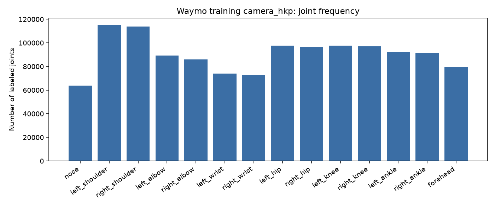
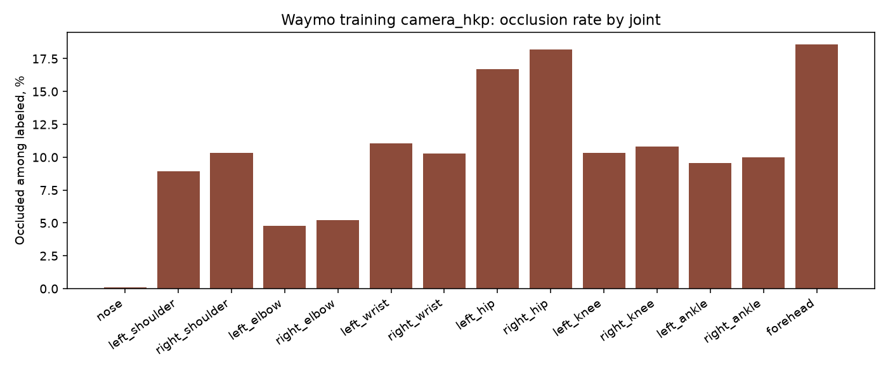

# Детекция ключевых точек пешеходов в сценах автономного вождения

**Отчёт по вехе 1 (ГП1): погружение в задачу**

Тургунов Аббос  
Курс: Дополнительные главы машинного обучения / *The Missing Semester of Your ML Education*  
НИУ ВШЭ, 23 сентября 2026 г.  
Репозиторий: `pose_estimation/`

---

## 1. Постановка задачи

Современный пайплайн беспилотного автомобиля состоит из восприятия (perception) и планирования (planner). Perception по камерам, лидарам и радарам строит векторную карту сцены; planner по этой карте выбирает траекторию. Пешеходы в карту обычно попадают как ограничивающие параллелепипеды (*bounding boxes*). Такой сигнал беден: начало шага, смена направления и потеря равновесия видны в позе существенно раньше, чем в сдвиге коробки.

**Цель проекта** — пройти путь от идеи до измеряемой системы **2D-детекции ключевых точек пешеходов** в driving-домене: данные, метрики, baseline, воспроизводимый репозиторий и сетка экспериментов.

Обучение perception и planner одновременно за отведённые вехи нереалистично; это совпадает с рекомендацией ментора. Мотивационный сюжет (перепланирование в момент потери равновесия) остаётся качественным ориентиром, а не KPI текущей итерации.

**Формально.** По изображению бортовой камеры \(I\) и (опционально) боксу пешехода \(b\) восстановить набор 2D-точек \(\{(x_i, y_i, v_i)\}_{i=1}^{K}\), где \(K \le 14\) — канонический camera-скелет Waymo, \(v_i\) — видимость.

Пайплайн:

\[
I \;\rightarrow\; \text{det. pedestrian / GT-box} \;\rightarrow\; \text{crop} \;\rightarrow\; \text{2D pose}.
\]

**В скоупе ГП1–ГП4:** выбор данных и протокол оценки на ручном GT; метрики качества и скорости; baseline из существующих 2D-моделей; инфраструктура репозитория; эксперименты quality/speed.

**Вне скоупа:** LSS / BEVFusion и 3D-скелет как основная задача; обучение планера; WOSAC / nuPlan как целевая метрика; веб-сервис и сжатие модели (ГП5–ГП6), если не останется времени. Проект выполняется в одиночку.

---

## 2. Выбор метрик

Задача — локализация суставов, поэтому метрики должны быть **масштаб-инвариантны** (пешеход на 15 м и на 50 м) и учитывать **неполную разметку** (не все 14 точек есть у каждого объекта).

### 2.1 OKS (основная)

Object Keypoint Similarity, как в COCO и в официальном коде Waymo:

\[
\mathrm{OKS}(y,\hat y)
=
\frac{1}{\sum_i \mathbf{1}[v_i>0]}
\sum_{i:\,v_i>0}
\exp\!\left(
\frac{-\lVert y_i-\hat y_i\rVert_2^2}{2\,(k_i\,s)^2}
\right).
\]

- \(s=\sqrt{wh}\) — масштаб GT-бокса;  
- \(k_i\) — константа типа сустава из `DEFAULT_PER_TYPE_SCALES` Waymo (нос \(0.052\), запястье \(0.124\), бедро \(0.214\), лоб \(0.158\) и т.д.): ошибка в пикселях на запястье штрафуется жёстче, чем такая же ошибка на бедре.

Сводно отчитываемся **OKS AP** по порогам \(0.50, 0.55, \ldots, 0.95\).

### 2.2 PCK (интерпретируемая)

Доля видимых суставов с \(\lVert y_i-\hat y_i\rVert_2 \le t\cdot k_i\cdot s\). Рабочая точка таблиц — **PCK@0.2**; дополнительно \(t\in\{0.05,0.1,0.3,0.5\}\). Срезы по группам: HEAD, SHOULDERS, ELBOWS, WRISTS, HIPS, KNEES, ANKLES.

### 2.3 Детекция и скорость

Если бокс предсказывается, а не берётся из GT, отдельно пишем mAP bbox @ IoU \(0.5\) по классу pedestrian — диагностика пайплайна, не главная цель. Скорость: latency / FPS на фиксированном CPU (ориентир порядка \(100\) мс на student), число параметров.

**Не используем как KPI ГП1–ГП4:** PEM / MPJPE в метрах (это 3D-challenge Waymo); ADE/FDE планера.

Реализация OKS/PCK без TensorFlow: `src/pose_av/metrics.py` (4 unit-теста). Модели с COCO-17 отображаются на Waymo-14: 13 суставов один-в-один, forehead — середина ушей.

---

## 3. Обзор датасетов: где есть скелет

| Датасет | Скелет GT | Можно ли кусок | Роль в проекте |
|---|---|---|---|
| **Waymo Perception v2.0.1** | Да: 14 joints, vis/occlusion; 172.6k camera / 10k laser (офиц.) | Да, parquet-компоненты | **Основной GT и eval** |
| nuScenes / nuImages | Нет («pose» = standing / sitting / moving) | mini, 10 сцен | Псевдо-GT, домен |
| nuPlan | Нет | сенсоры \(\sim\)16 TB | Планер, не ГП1–ГП4 |
| WOSAC / WOMD | Нет, только коробки 8 с @ 10 Hz | scenario-сплиты | Некуда вставить keypoints в офиц. метрику |
| PedX | 18 2D joints + SMPL | Sequence2 \(\sim\)4.8 GB | Запасной driving-срез |
| JAAD / PIE / TITAN | Нет | видео | Поведение, не pose GT |

**Motion Dataset качать не нужно** — там нет keypoints. Нужен именно **Perception v2.0.1 (modular)**. Картинки целиком (\(\sim\)387 GB) не качаем: на ГП2 — выбранные сегменты `camera_image` + `camera_box`.

---

## 4. Первичный анализ данных (EDA)

Проанализирован локальный дамп **`training/camera_hkp`** (Perception v2.0.1): 798 parquet-файлов, 36.5 MB. Картинки на этом этапе не требуются: в таблице уже есть 2D-координаты и флаги окклюзии. Скрипт: `scripts/eda_waymo_hkp.py`.

### 4.1 Объём разметки

| Величина | Значение |
|---|---|
| Файлов-сегментов | 798 |
| Сегментов без keypoints | 359 (45%) |
| Сегментов с разметкой | 439 |
| Объектов (camera human) | **146 002** |
| Уникальных камерных кадров | 27 971 |
| Объектов с 2D keypoints | 146 002 (100%) |
| 3D-координаты в camera-компоненте | 0 (3D лежит в `lidar_hkp`, вне скоупа) |
| Keypoints на объект: mean / median / min–max | 8.67 / 9 / 1–14 |
| Диапазон \(x,y\) (px) | \(x\in[0.5;\,1919]\), \(y\in[2.0;\,1759]\) |

Официальная цифра 172.6k camera-объектов — train+val+test. Наш train-срез (146k) с ней согласован: остаток — validation/test.

Пустые сегменты ожидаемы: keypoints размечены не на всей Perception, а на подмножестве. На ГП2 картинки качаем **только для nonempty-сегментов**.

Среднее \(\approx 5.2\) размеченных человека на кадр с разметкой; \(\approx 333\) объекта на nonempty-сегмент.

### 4.2 Камеры

Идентификаторы Waymo (`CameraName`): чаще всего камера `1` (типично FRONT).

| camera_name | Объектов | Доля |
|---|---|---|
| 1 | 58 440 | 40.0% |
| 2 | 29 437 | 20.2% |
| 3 | 33 421 | 22.9% |
| 4 | 11 475 | 7.9% |
| 5 | 13 229 | 9.1% |

Боковые и задние виды дают другой ракурс (часто спина, нет носа) — срезы по камере обязательны при оценке.

### 4.3 Частота суставов и окклюзии

Полный скелет из 14 точек — редкость (медиана 9). `head_center` в camera-таблице отсутствует (это laser-скелет). Нос размечен реже плеч: на виде сзади носа нет, плечи есть.



Рис. 1. Сколько раз каждый сустав встречается в train `camera_hkp`.

| Сустав | Число меток | Окклюзия среди размеченных |
|---|---|---|
| nose | 63 653 | 0.08% |
| left_shoulder | 115 274 | 8.9% |
| right_shoulder | 113 817 | 10.3% |
| left_elbow | 89 129 | 4.8% |
| right_elbow | 85 835 | 5.2% |
| left_wrist | 73 838 | 11.0% |
| right_wrist | 72 736 | 10.3% |
| left_hip | 97 522 | **16.7%** |
| right_hip | 96 821 | **18.2%** |
| left_knee | 97 734 | 10.3% |
| right_knee | 96 914 | 10.8% |
| left_ankle | 92 142 | 9.5% |
| right_ankle | 91 508 | 10.0% |
| forehead | 79 297 | **18.6%** |



Рис. 2. Доля окклюзий среди *уже размеченных* точек. Бедра и лоб закрываются чаще всего (одежда, другие люди, самоперекрытие). Нос, если размечен, почти всегда видим.

**Выводы для модели.**

1. Считать OKS/PCK только по \(v_i>0\), не требовать 14 точек.  
2. Резать метрики по камере, по числу видимых суставов и (на ГП2, когда появятся боксы) по площади кропа — прокси дистанции.  
3. COCO-pretrained модели увидят доменный сдвиг: ночные кадры, мелкие пешеходы, вид со спины.  
4. nuScenes по-прежнему без скелета: псевдо-GT учителем допустим как extra data, **eval только Waymo**.

---

## 5. Архитектура решения

Выбран путь **2D-кропы + существующие pose-сети**, а не 3D LSS/BEVFusion.

1. Локализация: GT-box Waymo (изолируем ошибку позы) и отдельно предсказанный детектор.  
2. Teacher (потолок на ГП2): ViTPose / HRNet.  
3. Student (скорость на ГП4): YOLO-pose или компактная heatmap-сеть.

3D-скелет по lidar (10k объектов) оставляем как future work: другой стек и другие метрики, в одиночку вместе с ГП2–ГП4 не закрывается.

---

## 6. План следующих вех

**ГП2.** Скачать `validation/camera_hkp` и `camera_image`/`camera_box` для небольшого набора nonempty-сегментов. Прогнать COCO-pretrained pose и teacher. Таблица: OKS AP, PCK@0.2, latency. Краткий обзор литературы (потолок 2D HPE vs driving). План сетки.

**ГП3.** Hydra, скрипты вместо тетрадок, логи прогонов, README, воспроизводимые команды.

**ГП4.** Fine-tune student на Waymo; срезы по камере / размеру бокса / окклюзии; компромисс качество–скорость.

---

## 7. Что сделано в репозитории к ГП1

- зафиксированы задача, скоуп и метрики;  
- код OKS/PCK и отображение COCO→Waymo (`pytest`: 4 passed);  
- скачан train `camera_hkp`;  
- EDA по 146 002 объектам (этот отчёт).

Команды:

```powershell
python -m pytest -q
python scripts/eda_waymo_hkp.py
```
