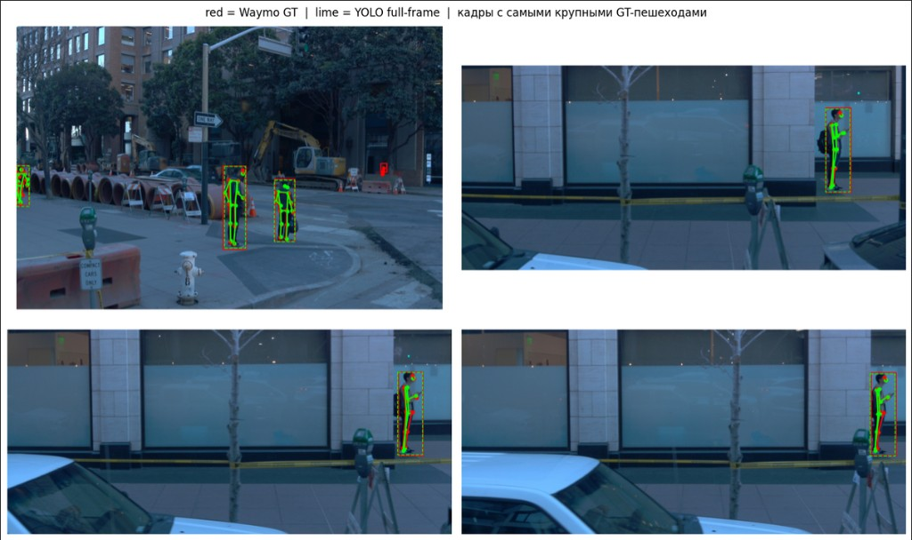

# Детекция ключевых точек пешеходов в сценах автономного вождения

**Отчёт по вехе 2 (ГП2): измеренный baseline**

Тургунов Аббос  
Курс: Дополнительные главы машинного обучения / *The Missing Semester of Your ML Education*  
НИУ ВШЭ, 23 сентября 2026 г.  
Репозиторий: `pose_estimation/`  
Ноутбук: `notebooks/gp2_baseline.ipynb` (Kaggle, GPU T4 / CUDA)

---

## 1. Цель вехи

ГП1 зафиксировал задачу, метрики (OKS / PCK@0.2), EDA по 146k объектам `camera_hkp` и пайплайн «кадр → бокс → 2D pose». На ГП2 нужен **не дизайн, а измерение**: прогон существующей 2D-модели на реальных кадрах Waymo, сравнение с литературой и план сетки.

Baseline — **не обучение**. Берём COCO-pretrained YOLOv8s-pose и смотрим, сколько качества уже есть на driving-домене «из коробки». Это нижняя точка для fine-tune на ГП4.

---

## 2. Протокол эксперимента

**Данные.** Один nonempty-сегмент Perception v2.0.1:

`10023947602400723454_1120_000_1140_000`

Компоненты: `camera_image` + `camera_box` + `camera_hkp` (архив `data/kaggle_gp2_slice.zip`, ~327 MB). На сегменте 497 GT-поз; в прогоне — **первые 40 кадров** с keypoints (ограничение по времени Kaggle).

**Модель.** `yolov8s-pose.pt`, Ultralytics, weights COCO-17. Маппинг на Waymo-14: 13 суставов один-в-один, forehead = середина ушей. Класс — person. `imgsz=1280`, `conf=0.35`, устройство CUDA.

**Два протокола** (изолируют разные ошибки):

| Код | Что делает | Что измеряет |
|---|---|---|
| `full_frame` (bottom-up) | YOLO по целому кадру, затем match предсказаний к GT по IoU боксов | совместная ошибка детекции + позы |
| `gt_crop` (top-down) | кроп по **GT-боксу** пешехода, YOLO по кропу | ошибка позы при известном человеке |

Это сознательно: на ГП1 выбран путь «2D-кропы», а не LSS. `gt_crop` — честная оценка pose-головы; `full_frame` показывает, сколько теряем на детекте мелких пешеходов.

**Метрики.** Те же, что в `src/pose_av/metrics.py`: mean OKS по видимым суставам (\(v_i>0\)), PCK@0.2 с порогом \(t\cdot k_i\cdot\sqrt{wh}\), unmatched GT. Latency/FPS — только full-frame (один проход сети на кадр).

**Визуализация.** Красный = Waymo GT, лайм = YOLO. Кадры с самыми крупными GT-пешеходами, не первые подряд (иначе все сцены почти одинаковые).

---

## 3. Измеренные метрики

Прогон: CUDA, 40/40 кадров.

| | Full-frame bottom-up | GT-crop top-down |
|---|---|---|
| Протокол | `full_frame` | `gt_crop` |
| Matched instances | 53 | **150** |
| Unmatched GT | **100** | 3 |
| mean OKS | 0.956 | 0.905 |
| PCK@0.2 | 0.464 | 0.435 |
| latency mean | 33.8 ms | — (pose по кропам, без единого FPS) |
| FPS | 29.5 | — |

JSON прогона:

```json
{
  "model": "yolov8s-pose.pt",
  "device": "cuda",
  "imgsz": 1280,
  "conf": 0.35,
  "segment": "10023947602400723454_1120_000_1140_000",
  "frames": 40,
  "full_frame_bottom_up": {
    "matched_instances": 53,
    "unmatched_gt": 100,
    "mean_OKS": 0.9559,
    "PCK@0.2": 0.4637,
    "latency_ms_mean": 33.84,
    "fps": 29.55
  },
  "gt_crop_top_down": {
    "matched_instances": 150,
    "unmatched_gt": 3,
    "mean_OKS": 0.9054,
    "PCK@0.2": 0.4348
  }
}
```



Рис. 1. Overlay на кадрах с самыми крупными GT-пешеходами. Скелет читается на ближних людях (стройка, тротуар у витрины). Это и есть рабочий вид baseline, а не ложные срабатывания на столбах.

---

## 4. Как читать цифры (без завышения)

**Покрытие важнее красивого OKS.** Full-frame матчит 53 объекта и пропускает 100 GT. Модель «видит» ближних крупных людей и почти не видит дальних. GT-crop закрывает **150 из 153** — пайплайн «сначала бокс, потом pose» на этом срезе работает.

**OKS 0.96 ≠ идеальная поза.** Mean OKS считается только по *matched*. Bottom-up в таблицу попадают крупные боксы: \(s=\sqrt{wh}\) большой, OKS прощает пиксельную ошибку. PCK@0.2 у Waymo жёсткий: порог \(0.2\cdot k_i\cdot s\), \(k_i\) уже \(\ll 1\) (нос \(0.052\), бедро \(0.214\)). Для человека \(\sim 80\times180\) порог на бедре порядка единиц пикселей. Поэтому PCK \(\approx 0.43{-}0.46\) при OKS \(\approx 0.90{-}0.96\) — ожидаемо, не баг метрик.

**GT-crop чуть ниже по OKS, чем full-frame** (0.91 vs 0.96), потому что в среднее входят мелкие и частично закрытые люди, которых bottom-up даже не матчил. Это более честная оценка student-модели.

**Скорость.** ~30 FPS @ 1280 на T4 для full-frame — запас по latency для student. Teacher (ViTPose) на ГП4 будет медленнее и измеряется отдельно.

**Ограничения прогона.** Один сегмент, 40 кадров, train-срез (не validation). Это baseline-точка, не лидерборд. Срезы по камере / площади бокса — в сетке ГП4, когда кадров станет больше.

---

## 5. Обзор литературы: теоретический потолок

Задача 2D HPE на COCO зрелая; на **бортовых камерах AV** отдельного публичного 2D-лидерборда почти нет (официальный Waymo Pose — 3D по lidar, MPJPE/PEM, вне скоупа ГП1–ГП4). Потолок берём из двух источников: COCO OKS-AP и качественный gap driving-домена.

### 5.1 Общий 2D HPE (COCO val, keypoints AP)

| Семейство | Характерный результат | Заметка |
|---|---|---|
| SimpleBaseline / HRNet | AP \(\sim\) 70–77 | heatmap, top-down |
| ViTPose-B / -L / -H | AP \(\sim\) 75–79+ | teacher-кандидат |
| RTMPose / RTMO | AP \(\sim\) 70–78, реалтайм | сильный student |
| YOLOv8-pose (n/s/m) | AP заметно ниже HRNet/ViTPose | один проход, скорость |

Цифры COCO **нельзя** напрямую сравнивать с нашим mean OKS: COCO AP — интеграл по порогам OKS 0.50:0.05:0.95 по *всем* инстансам датасета, у нас — среднее OKS по matched на 40 кадрах одного сегмента.

### 5.2 Что это значит для проекта

1. **Потолок качества (teacher, GT-crop, после адаптации к Waymo):** ориентир — OKS AP в духе сильного top-down на COCO, на практике цель ГП4: **подтянуть PCK@0.2 существенно выше 0.45** и не потерять покрытие кропов. ViTPose / HRNet на GT-кропах — оценка потолка *на наших* картинках, не цитата с paperswithcode.

2. **Потолок скорости (student):** YOLO-pose / RTMPose порядка десятков FPS на T4 @ 640–1280. Наш full-frame уже \(\approx 30\) FPS @ 1280; после fine-tune цель — не деградировать ниже приемлемых \(\sim\)15–30 FPS без крайней нужды.

3. **Доменный зазор.** COCO — относительно крупные люди, фронт. Waymo: мелкий масштаб, спина, стройка, частичная окклюзия (EDA ГП1: медиана 9 из 14 суставов, бёдра/лоб чаще закрыты). Без fine-tune даже хороший COCO-веса будет **терять дальних** (наш unmatched 100/153). Это главный рычаг ГП4, не смена архитектуры на LSS.

4. **3D-challenge Waymo** (laser keypoints, \(\sim\)10k объектов) даёт MPJPE в метрах. Это другой стек и другая метрика; в потолок 2D-таблицы не ставим.

**Рабочая гипотеза потолка на нашем протоколе gt_crop:** после teacher + fine-tune student mean OKS останется высоким (\(\gtrsim 0.9\) на крупных), а **PCK@0.2** — метрика, которую реально двигать (цель: заметно выше 0.45, срезы по размеру бокса отдельно). Full-frame AP/recall — отдельная ось (детектор), не смешивать с pose-OKS.

---

## 6. План экспериментов (ГП3–ГП4)

Инфраструктура (ГП3), потом сетка (ГП4). Не учить модель в тетрадке.

**ГП3 — репозиторий.**

- Hydra-конфиг (`model`, `imgsz`, `conf`, `protocol`, `segment`, `max_frames`).
- Скрипты `eval_pose.py` / позже `train_pose.py` вместо единственного Kaggle-notebook как источника правды.
- Логи прогона: JSON метрик + путь к весам + git hash / дата.
- README с командами eval на одном сегменте и на списке сегментов.
- Ноутбук ГП2 остаётся как воспроизведение измеренного baseline.

**ГП4 — сетка (качество / скорость / данные).**

| Ось | Что меняем | Зачем |
|---|---|---|
| Протокол | full-frame vs gt_crop vs pred-box crop | разделить детект и позу |
| Модель | YOLOv8n/s-pose; teacher ViTPose-B на кропах | student vs потолок |
| Вход | `imgsz` 640 / 1280; `conf` 0.25 / 0.35 / 0.5 | скорость и recall |
| Домен | COCO weights vs fine-tune на Waymo nonempty-сегментах | закрыть unmatched дальних |
| Срезы | камера 1 vs 2–5; tertiles площади бокса; число видимых суставов | не прятать мелких в среднем OKS |
| Данные | 1 сегмент → несколько train + **validation** `camera_hkp` | не отчитываться только train-кадрами |

KPI сетки: PCK@0.2 и доля unmatched на gt_crop; отдельно recall full-frame; latency student. Не KPI: ADE/FDE планера, 3D MPJPE.

---

## 7. Выводы

1. Baseline **измерен**, не спроектирован: YOLOv8s-pose, CUDA, 40 кадров одного сегмента Waymo.  
2. Top-down по GT-кропу — рабочая постановка (150/153 GT, mean OKS 0.91, PCK@0.2 0.43). Bottom-up на полном кадре быстрый (~30 FPS), но пропускает большинство GT.  
3. Высокий OKS при среднем PCK — следствие масштаба крупных matched-боксов и жёсткого \(k_i\) в PCK. В таблицах ГП4 ведущая колонка — **PCK@0.2 + покрытие**, не одно mean OKS.  
4. Литературный потолок — сильный COCO top-down (ViTPose/HRNet); на AV его надо подтвердить teacher-прогоном на тех же кропах. Главный gap — домен и мелкий масштаб, не отсутствие 3D LSS.  
5. Дальше: инфраструктура ГП3, затем fine-tune и срезы ГП4.

Команды воспроизведения (Kaggle): инструкция `reports/gp2_kaggle.md`, ноутбук `notebooks/gp2_baseline.ipynb`, датасет-zip без `\` в путях.
